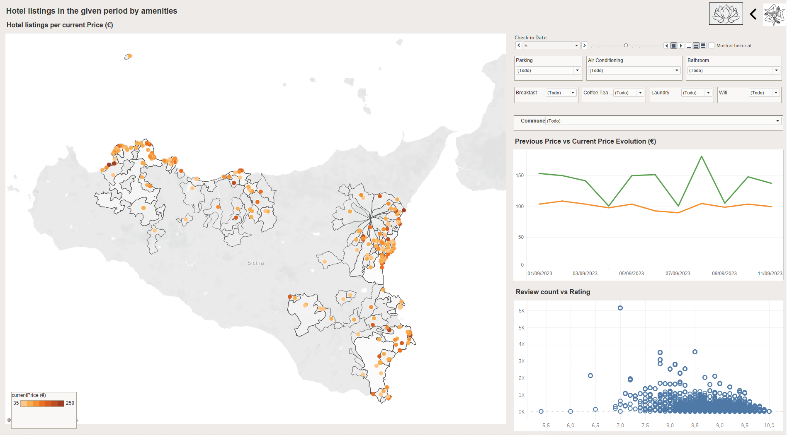
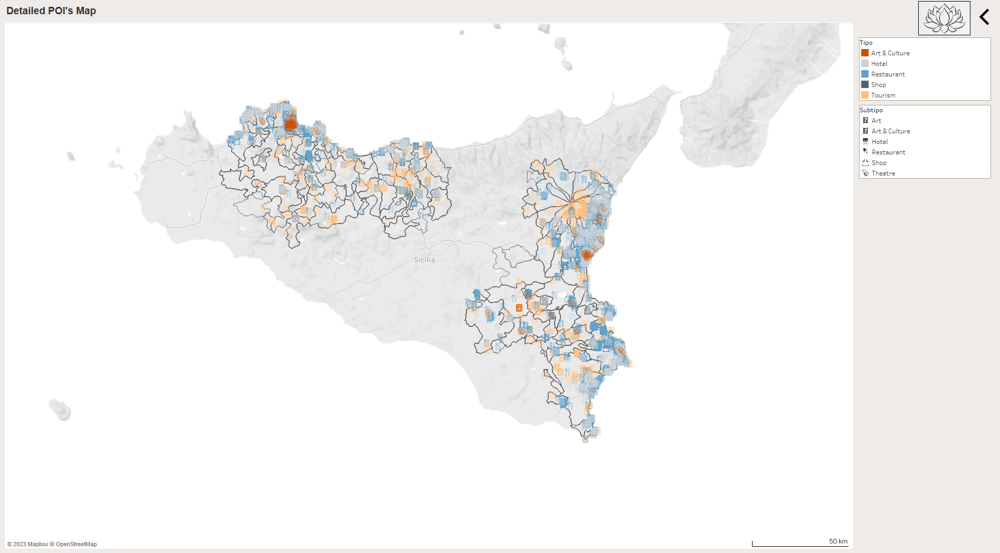

# vuelve conmigo a italia

# Index

1. `data` 
   1. [arrivals_nights_monthly](data/arrivals_nights_monthly.csv) -> monthly data for the arrivals on the island of Sicily
   2. [hotels](data/hotels_monthly.csv) -> yearly data for hotels -- number of beds, number of stablishments, bumber of bathrooms.
   3. [booking](data/booking.csv) -> hotel listings in Sicily.
   4. [df_pois](data/df_pois.geojson) -> the points of interest for Sicily in geojson format.
   5. [weather_sicily](data/weather_sicily.csv) -> the data for the weather in Sicily.
2. `imagenes` -> images used on the dashboard and on the readme file
3. `notebooks`
   1. [`01_scrapping.ipnyb`](notebooks/01_scrapping.ipynb) -> scrapping of the hotel listings
   2. [`02_cleaning.ipnyb`](notebooks/02_cleaning.ipynb) -> cleaning of the hotel listings previously scrapped
   3. [`03_istat_monthly_data_cleaning.ipnyb`](notebooks/03_istat_monthly_data_cleaning.ipynb) -> cleaning of the public data for hotels, arrivals and nights spent in touristic allocations
   4. [`04_osm_pois.ipnyb`](notebooks/04_osm_pois.ipynb) -> osm pois data extraction + cleaning
   5. [`05_weatherAPI.ipnyb`](notebooks/05_weatherAPI.ipynb) -> weather data extraction + cleaning
4. `src`
   1. [`biblioteca.py`](src/biblioteca.py) -> support file that stores the data equivalences used in the `03_istat_monthly_data_cleaning` file
   2. [`soporteCleaning.py`](src/soporteCleaning.py) -> support file for the data equivalences used in the `03_istat_monthly_data_cleaning` file
   3. [`soporteScrapping.py`](src/soporteScrapping.py) -> support file for the webscrapping file `01_scrapping`

# Context

The aim of this porject is to create a dashboard about a topic of choice, after preparing and cleaning a dataset. 

After watching the season 2 of the HBO series `White Lotus` I was heavily influenced to spend my summer vacations in Sicily. So I created a [dashboard](https://public.tableau.com/app/profile/anna1413/viz/sicily/01) in order to plan my trip, adding information on tourim in the island, the hotel listing prices and the relevant landmarks that might be worth seeing.  

The action distributes between Taormina, Noto, Testa dell'Acqua, Palermo and finally Catania. The dashboard includes a filter that sorts the info in order to see what data, listings or points of interest are available on those locations, in order to reenact the landscapes in which the series was filmed.

# Data

## ISTAT data

The source for the tourist data is [ISTAT](http://dati.istat.it/) *(Instituto Nazionale di Statistica)*. The data is available via .csv or .xlsx format. The two sources of monthly socioeconomic data are:
- `arrivals, night spent` -> under Servizi > Turismo > Indicaori del turimos - dati mensili > Arrivi, presenza media - mensili. The data is available monthly since 01-1990 until 11-2022.
- `hotels` -> under Servizi > Turismo > Capacità degli esercizi ricettivi - dati comunali > Capacità degli esercizi ricettivi per Movimento dei clienti negli esercizi ricettivi per tipo di esercizio - mensili - com. The data is available yearly since 1990 until 2021.

## POIs

The POIs *(Points of Interest)* are extracted from the open data company GeoFabrik. The data for Italy is available [here](https://download.geofabrik.de/europe/italy.html), and it's scrapped and download in shape data. The data will be later process and represented on the dashboard, in order to quantify the interesting sightseeing locations and the accomodations available.

## Hotel listings

The hotel listings are scrapped from booking. Once obtained, the data is cleaned and classified in order to evaluate the amenities available on each of the listings (free parking, air conditioning, ensuit bathroom, breakfast available, free wifi and coffee/tea machine available on the room). 

The data period available is from 01/09/2023 to 10/09/2023.

## Weather data

The weather data is obtained from [OpenMeteo API](https://open-meteo.com/). The data extracted is for the hourly temperature and relative humidity, from 2008 until today.

# Further steps

In the future minght be interesting to calculate the better located hotels. Based on the location, add the altitude of the terrain and see which ones have the better view from the sea, where are they located in town and if they are easily accesible by walking.

Also might also be interesting to see where most of the POI's are located and what are the best located hotels based on the selection.

# Libraries used

- [**pandas**](https://pypi.org/project/pandas/): this library is used to work with related and table like data structures.
- [**numpy**](https://pypi.org/project/numpy/): library used for scientific calculation.
- [**pickle**](https://docs.python.org/3/library/pickle.html): a module that generates files that can be used within python to store any kind of data -- from dataframes to dicionaries and so on.
- [**clean-text**](https://pypi.org/project/clean-text/): this library helps to normalise text extracted from social media -- cleans emojis, weird characters and so on.
- [**requests**](https://pypi.org/project/requests/): requests is used to make http requests -- mostly used on the API calls notebooks
- [**os**](https://docs.python.org/es/3.10/library/os.html): os is used for operating system functionalities within python -- for example, accessing .pickle files or navigating on folders within this project.
- [**tqdm**](https://pypi.org/project/tqdm/): this library is used to print a progress meter when iterating.
- [**re**](https://docs.python.org/3/library/re.html): re provides regular expression matching operations to python -- mostly used for cleaning the api results.
- [**selenium**](https://pypi.org/project/selenium/): this package is used to automate web browser interaction from Python -- used for webscrapping.
- [**beautifulSoup**](https://pypi.org/project/beautifulsoup4/): this library scrapes information from webpages, iterating searching and modifying the html parser.
- [**time**](https://docs.python.org/3/library/time.html): this module provides various time-related functions -- in this case, related to scraping to add timers.
- [**sys**](https://docs.python.org/3/library/sys.html): this library provides access to some variables used or maintained by the interpreter and to functions that interact strongly with the interpreter.
- [**warnings**](https://docs.python.org/3/library/warnings.html): this library helps to hide the annoying warnings that python sometimes throws.
- [**folium**](https://pypi.org/project/folium/): this library allows to represent apping via Leaflet.js on a Jupyter Notebook.
- [**geopy**](https://pypi.org/project/geopy/): this is a python client used for geolocating the hotel listings based on the address, to get the coordinates in order to represent them on the dashboard.
- [**geopandas**](https://pypi.org/project/geopandas/): this is a library that allows to work with geospatial data thorugh python, combining the usability of the pandas and shapely library. This library is used to manipulate all of the geospatial data used on the project (POIs, hotel listings once geolocated)
- [**zipfile**](https://docs.python.org/3/library/zipfile.html): this library is used to manipulating zip files. In this case, to unzip the data downloaded from OSM.
- [**io**](https://docs.python.org/3/library/io.html): this library is used for operating with files objects in python. In this case is used to unzip the downloaded zips from data.
- [**fiona**](https://pypi.org/project/Fiona/): fiona is a library used to manage GIS data in python. It is used to manipulate data on shape and GeoPackage format.

# Contact

Feel free to contact me [here](mailto:annassanchez@gmail.com) if you want to know more or find any mistakes.